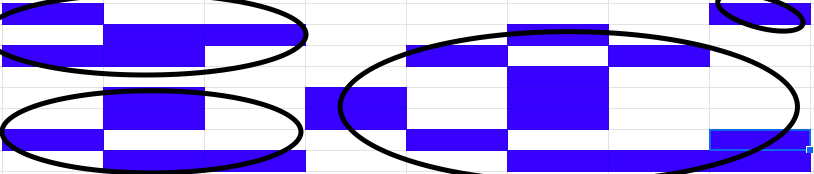

# Recursion - Counting cells in a blob

- 색칠된 부분이 연결되어 하나의 덩어리가 cell
- 연결은 상하좌우 및 대각선으로 연결이 됨.

### Thinking

- 현재 픽셀이 속한 blob의 크기를 카운트하려면
  - 현재 픽셀이 image color가 아니라면
    - 0을 반환.
  - 현재 픽셀이 image color라면
    - 먼저 현재 픽셀을 카운트한다. (count = 1)
    - 현재 픽셀이 중복 카운트되는 것을 방지하기 위해 ***다른 색으로*** 칠한다.
    - 현재 픽셀에 이웃한 모든 픽셀들에 대해서
      - 그 픽셀이 속한 blob에 크기를 카운트하여 카운터에 더해준다. 
  - 카운터를 반환한다.

### 알고리즘 - 간단코딩

~~~
// 현재 위치의 픽셀이 grid밖이면
if pixel(x, y) is outside the grid
    the result is 0;
// 이미지 픽셀이 아니거나 또는 이미 카운팅되었으면
else if pixel(x, y) is not an image pixel or aleady counted
    the result is 0;
// 카운팅안된 이미지 픽셀!
else
    // 해당 픽셀을 빨간색으로(이미 카운트됨을 표시)
    set the color of the pixel(x, y) to a red color;
    // 1 + 인접한 각각의 픽셀을 Recursion한 결과값
    the result is 1 plus the number of cells in each piece of the blob that includes a nearest neighbour;
~~~

### C 코딩

~~~c
// countCells.c

#include <stdio.h>

#define N 8
#define IMAGE_COLOR 1
#define ALREADY_COUNTED 2

int countCells(int x, int y, int grid[][8])
{
    // 현재 위치의 픽셀이 grid밖이면..
    if (x < 0 || x >= N || y < 0 || y >= N)
        return 0;
    // 이미지 픽셀이 아니면...
    else if (grid[x][y] != IMAGE_COLOR)
        return 0;
    else
    {
        grid[x][y] = ALREADY_COUNTED;
        return 1 + countCells(x - 1, y - 1, grid) + countCells(x, y - 1, grid) + countCells(x + 1, y - 1, grid) + countCells(x - 1, y, grid) + countCells(x, y, grid) + countCells(x + 1, y, grid) + countCells(x - 1, y + 1, grid) + countCells(x, y + 1, grid) + countCells(x + 1, y + 1, grid);
    }
}

// main.c
#include <stdio.h>
#include "countCells.h"

int main(void)
{

    int grid[][8] = {
        {1, 0, 0, 0, 0, 0, 0, 1},
        {0, 1, 1, 0, 0, 1, 0, 0},
        {1, 1, 0, 0, 1, 0, 1, 0},
        {0, 0, 0, 0, 0, 1, 0, 0},
        {0, 1, 0, 1, 0, 1, 0, 0},
        {0, 1, 0, 1, 0, 1, 0, 0},
        {1, 0, 0, 0, 1, 0, 0, 1},
        {0, 1, 1, 0, 0, 1, 1, 1}};
    int result;
    result = countCells(5, 3, grid);
    printf("result: %d", result);

    return 0;
}
~~~

### 실행결과

~~~
result: 13
~~~