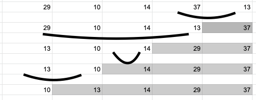

## 선택정렬

- 각 루프마다...
  - 최대 원소를 찾는다.
  - 최대 원소와 맨 오른쪽 원소를 교환한다.
  - 맨 오른쪽 원소를 제외한다.
- 하나의 원소만 남을 때가지 위의 루프를 반복.

- 가장 큰 원소의 값을 찾는다.
- 맨 오른쪽과 바꾼다.
- 오른쪽부터 하나씩 배열 크기를 줄인다.

### 수도 코딩

~~~
selectionSort(A[], n)
{
    for last <- n downto 2 {
        A[1...last] 중 가장 큰 수 A[k]를 찾는다.
        A[k] <-> A[last] swap
    }
}
~~~

1. for루프로 n-1번 반복
2. 가장 큰 수를 찾기위한 비교횟수: n-1, n-2, ..., 2, 1

- 시간복잡도 O(n^2)

### 코딩

~~~c
// selectionSort.c

#define swap(type, x, y) do{ type temp = x; x = y; y = temp; }while(0)

void selectionSort(int arr[], int n)
{

    for (int last = n - 1; last > 0; last--)
    {
	    int maxIndex = 0;
	    for(int i = 1 ; i <= last ; i++){
		if(arr[maxIndex] < arr[i]){
			maxIndex = i;
		}	
	    }
	    swap(int, arr[maxIndex], arr[last]);
    }
}

// main.c
#include <stdio.h>
#include "selectionSort.h"

int main(void)
{

	int arr[] = {29, 10, 14, 37, 13};
	int n = 5;

	selectionSort(arr, n);

	for (int i = 0; i < n; i++)
	{
		printf("arr[%d]: %d\n", i, arr[i]);
	}

	return 0;
}
~~~

### 실행결과

~~~
arr[0]: 10
arr[1]: 13
arr[2]: 14
arr[3]: 29
arr[4]: 37
~~~